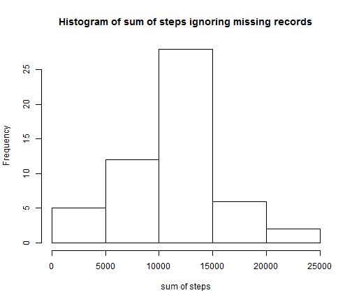
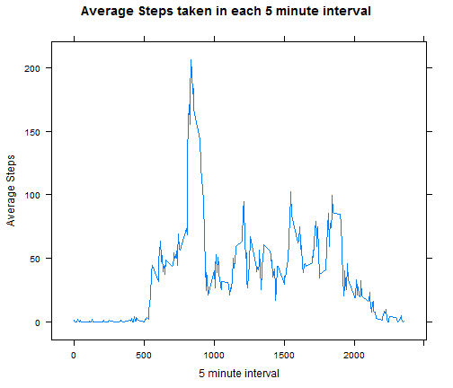
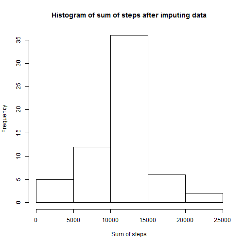
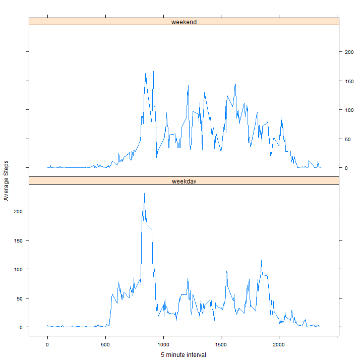

Assignment 1 - Reproducible Reserach
========================================================

## Loading and transforming the data

The below code loads the basic libraries needed for the assignment, reads the data from file into data frame and does necessary transformation of variables.


```r
library(lattice)
# setting the working directory
setwd("C:/backup/backup/coursera/reproducible research/assignment 1")
#read data from csv file
dataset <- read.csv("activity.csv")
#Converting into data type 'date'
dataset$date <- as.Date(dataset$date)
```

## Mean Total Steps per Day

There are many records in the dataset with missing records. We first omit those missing records. We then split the dataset into subsets one for each date and then compute sum of steps for each date.
The below code shows histogram of Sum of steps taken each day, mean and median of sum of steps 


```r
#to obtain dataset without missing values
datasetwm <- na.omit(dataset)

#splitting data into subsets for each date
x <- split(datasetwm , datasetwm$date)
#obtaining total steps taken for each day
stepsum <- sapply(x, function(e) sum( e[,1]) )

#showing the histogram
hist(stepsum, xlab = "sum of steps", main = "Histogram of sum of steps ignoring missing records")
```

 

```r
mean(stepsum)
```

```
## [1] 10766
```

```r
median(stepsum)
```

```
## [1] 10765
```

## Average Daily Activity Pattern

To do the analysis of daily activitiy pattern, we split the dataset into multiple subsets one each for time interval. We then apply mean function to find out avearage steps taken for each interval. We then use xyplot to show the plot


```r
#splitting data into subsets for interval
y <- split(datasetwm , datasetwm$interval)
#obtaining mean steps taken for each interval
ms<- sapply(y, function(e) mean( e[,1]) )

#creating a data frame for average steps for each time interval
df1 <- data.frame(cbind(ms), as.numeric(names(ms)))
colnames(df1) <- c("averagesteps","interval")

xyplot(df1$averagesteps ~ df1$interval, type = "l" , xlab = "5 minute interval", ylab = "Average Steps", main = "Average Steps taken in each 5 minute interval")
```

 

To identify which 5 minute interval on an average across all days covers the maximum steps, we use the following code


```r
df1$interval[df1$averagesteps == max(df1$averagesteps)]
```

```
## [1] 835
```

## Imputing missing values

 1.**Numer of rowns with missing values** :The below code calculates the number of rows where missing values are present


```r
#number of records with NA
sum(is.na(dataset[,1]))
```

```
## [1] 2304
```

 2.**Filling the missing values**  : In order to fill the missing values, we first separate the original data into two parts *m0* and *m1*. *m0* represents non NA rows and *m1* represents rows with NA. The next job is to take *m1* and fill another column which gives average steps for each time interval. We use merge function to solve the problem. Merge function is similar to inner join in SQL. Here we join *m1* and *df1* (data frame with average steps for each interval) on the column *interval*. Now we get output *m2* with the values we wanted. We now use rbind function to make the union of *m0* and *m2* after making column names same. We now use the order function to order the rows on basis of *date* and *interval* and save ouput in data frame *m4*.
 
 3.**New data set equal to original set but with missing data filled in**  : So dataframe *m4* has no records with NA. If the data is present in original dataset, we retained it else we used average steps of that time interval to fill the missing values.
 

```r
#new dataset only with non NA records
m0 <- dataset[is.na(dataset[,1]) == FALSE, ]
#new dataset with NA records
m1 <- dataset[is.na(dataset[,1]),]

#Inner join M1 with df1, this populates average steps for each time interval in output as additional column for NA cases
m2 <- merge(m1,df1,by = "interval")
#saving average steps value in steps variable for NA cases
m2$steps <- m2$averagesteps
#Merging data sets 
m3 <- rbind(m0, m2[-4])

#ordering data set in original order
m4 <- m3[order(m3[,2],m3[,3]),]
```

 4.**Histogram, mean and median of total steps after imputing missing data**  : 
 
 

```r
#splitting data into subsets for each date
x1 <- split(m4 , m4$date)
#obtaining total steps taken for each day
stepsum1 <- sapply(x1, function(e) sum( e[,1]) )

#showing the histogram
hist(stepsum1, xlab = "Sum of steps", main = "Histogram of sum of steps after imputing data")
```

 

```r
mean(stepsum1)
```

```
## [1] 10766
```

```r
median(stepsum1)
```

```
## [1] 10766
```

If we compare the mean and median to the initial values at the start of the assignment, we don't see any impact in mean. There is a slight difference in the median. This is because after we impute the data, we have added more records to the data set, hence we see a slight movement in median because of addition of records. Overall we can safely say that impact of imputing missing data on estimates is very less


## Acitivity Pattern comparison between weekdays and weekends

We use the weekdays function in R to get extract day from date. We then created a weeekend flag to indicate whether a given day is weekend or not. Using the flag, we created a factor variable with two levels "weekday" and "weekend" for each row in the dataset. Once the factor variable is created, we picked only relevant variables into the final dataset.

We now split the dataset into two data frames *a* and *b* where *a* represents weekday data and *b* represents weekend data. We then created data frames *df2* and *df3* which contain average steps taken for each time interval in weekdays and weekends respectively.

We used rbind function to do the union of datasets *df2* and *df3* and created output *df4*. We then added additional column 'dayofweek' to identify which set the record belongs to. This field will be useful in creating a panel plot category wise.

We now use xyplot of library lattice, to plot average steps against time interval for each category (weekdays and weekends)


```r
#finding out the day of the week
m4$day <- weekdays(m4$date)
wend <- c("Saturday", "Sunday")
m4$weekendflag  <-  m4$day %in% wend
m4$dayofweek[m4$weekendflag ] = "weekend"
m4$dayofweek[m4$weekendflag == FALSE] = "weekday"
m4$dayofweek<- as.factor(m4$dayofweek)

#creating the final data frame with only relevant columns
datasetfv <- m4[, c(1,2,3,6)]

#splitting weekday data into subsets one for each interval
a <- split(datasetfv[datasetfv$dayofweek == "weekday",] , datasetfv$interval[datasetfv$dayofweek == "weekday"])
#obtaining mean steps taken for each interval
msa <- sapply(a, function(e) mean( e[,1]) )

#creating a data frame for average steps for each time interval
df2  <- data.frame(cbind(msa), as.numeric(names(msa)))
colnames(df2) <- c("averagesteps","interval")
df2$dayofweek <- "weekday"

#splitting weekend data into subsets one for each interval
b <- split(datasetfv[datasetfv$dayofweek == "weekend",] , datasetfv$interval[datasetfv$dayofweek == "weekend"])
#obtaining mean steps taken for each interval
msb <- sapply(b, function(e) mean( e[,1]) )

#creating a data frame for average steps for each time interval
df3  <- data.frame(cbind(msb), as.numeric(names(msb)))
colnames(df3) <- c("averagesteps","interval")
df3$dayofweek <- "weekend"


df4 <- rbind(df2,df3)
df4$dayofweek<- as.factor(df4$dayofweek)

layout = c(2,1)
xyplot(df4$averagesteps ~ df4$interval |df4$dayofweek , type = "l" , xlab = "5 minute interval", ylab = "Average Steps",
,layout = c(1,2))
```

 

### Observations 

From the above plot we can make the following observations

  1. Maximum number of steps is considerably less in weekends when compared to weekdays. In weekdays this number is above 200 where as for weekends it is around 150.
  2. we can observe a shift in peak occurances. In weekdays we see the peak coming around 830, but for weekends we see it coming after 9


```r
max(df2$averagesteps)
```

```
## [1] 230.4
```

```r
df2$interval[df2$averagesteps == max(df2$averagesteps)]
```

```
## [1] 835
```

```r
max(df3$averagesteps)
```

```
## [1] 166.6
```

```r
df3$interval[df3$averagesteps == max(df3$averagesteps)]
```

```
## [1] 915
```

### Inference

From the above analysis, we can infer that people tend to take less steps during weekends and they generally start little late as compared to weekdays. 
